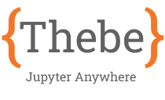

# Thebe: Integrate Jupyter based computation into web apps and static web pages

> **Note**: This readme has been updated for the 0.9.0 release
>
> The previous README for 0.8.x is now [located here](README_0.8.x.md), or alternatively see the [0.8.x branch](https://github.com/jupyter-book/thebe/tree/0.8.x).

> **Important**
>
> `thebe` 0.9.0 is still under development and documentation is work in progress (PRs welcome!)

Thebe is a set of libraries allowing web applications and static web pages to provide interactive computation backed by a Jupyter kernel. It is organized in multiple libraries to allow it to be used flexibly in different web contexts.

Thebe comprises the following packages (located in the `packages/` folder in this repo):

- [`thebe`](packages/thebe) - a browser bundle providing the same high level functionality found in earlier versions of `thebe`. Add the js & css bundles to your webpage, along with configuration information and make code cells editable, executable and interactive.
- [`thebe-core`](packages/core) - a typescript library shipped as esm/cjs/browser-bundle providing access to low level runtime objects and functions for working with Jupyter Servers, Sessions, Notebooks and Cells.
- [`thebe-lite`](packages/lite) - a drop in typescript library shipped as a browser bundle that can be side-loaded alongside `thebe-core` that adds a [`jupyterlite`](https://github.com/jupyterlite) server for WASM based kernels.
- [`thebe-react`](packages/react) - a typescript library providing React hooks and provider components for using `thebe-core` functionality within React applications.

## Documentation

The latest thebe documentation is build using [mystmd](https://mystmd.org) and is [hosted here](https://mystmd.org/docs/thebe).

## Demos

The demo page from `apps/simple` are hosted [here on github pages](https://jupyter-book.github.io/thebe) which let's you check out the interactivity that the top level `thebe` library provides along with `thebe-lite` for JupyterLite based `pyodide` kernel access.

## Development Setup

For the latest information on setting up a local development environment see [CONTRIBUTING.md](./CONTRIBUTING.md) in this repository.

### Legacy information on `thebe` builds is here

For more information on contributing to `thebe`, see [the `thebe` contributing documentation](https://thebe.readthedocs.io/en/latest/contribute.html) although note that

## Acknowledgements

`thebe` was developed as a part of [OpenDreamKit](http://opendreamkit.org/) – Horizon 2020 European Research Infrastructure project (676541).
It is currently stewarded by [the Executable Books Project](https://jupyter-book.org/en/latest/#acknowledgements).
Additional support was provided by the U.S. Department of Education Open Textbooks Pilot Program funding for the LibreTexts project (P116T180029).
